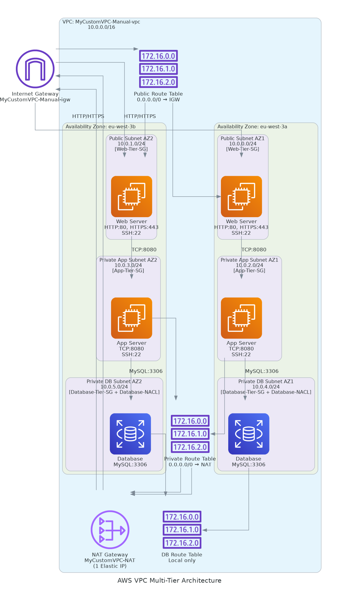
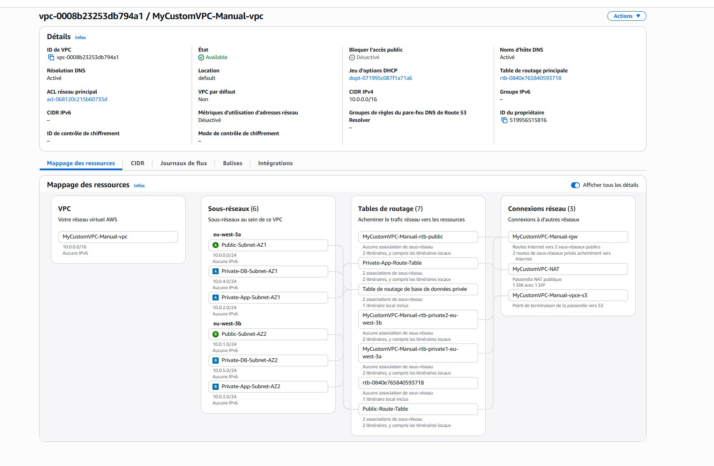

# AWS VPC Multi-Tier Architecture Lab

## Contexte
Projet réalisé dans le cadre d’une formation en cybersécurité.  
Objectif : comprendre la conception d’une architecture réseau AWS sécurisée.

## Architecture

Infrastructure composée de :

- 1 VPC (10.0.0.0/16)
- 6 subnets :
  - 2 subnets publics
  - 2 subnets privés applicatifs
  - 2 subnets privés base de données
- 1 Internet Gateway
- 1 NAT Gateway
- tables de routage distinctes
- 1 VPC Endpoint S3

## Logique réseau

- Les subnets publics sont accessibles depuis Internet via l’Internet Gateway
- Les subnets privés applicatifs sortent via la NAT Gateway
- Les subnets base de données sont isolés sans accès direct Internet

Flux typique :
Internet → Subnet public → Subnet privé applicatif → Subnet DB

## Logique sécurité

- Aucune base de données exposée publiquement
- Sortie Internet contrôlée via NAT
- Segmentation réseau stricte (public / app / db)
- Réduction de la surface d’attaque

## Différences clés

### Security Groups vs NACL

- Security Group :
  - stateful
  - appliqué aux instances
  - autorisations uniquement

- NACL :
  - stateless
  - appliqué aux subnets
  - autorise et refuse

## Ce que j’ai appris

- Structurer un réseau AWS avec VPC
- Différencier subnets publics et privés
- Comprendre le rôle du NAT et de l’Internet Gateway
- Mettre en place une segmentation réseau
- Appliquer des principes de sécurité réseau cloud

## Limites

- Projet pédagogique
- Pas de déploiement applicatif réel
- Pas d’automatisation Terraform

## Illustrations

